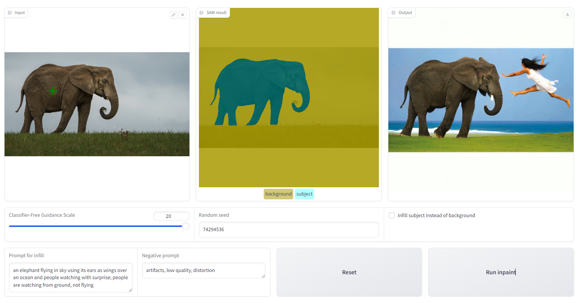
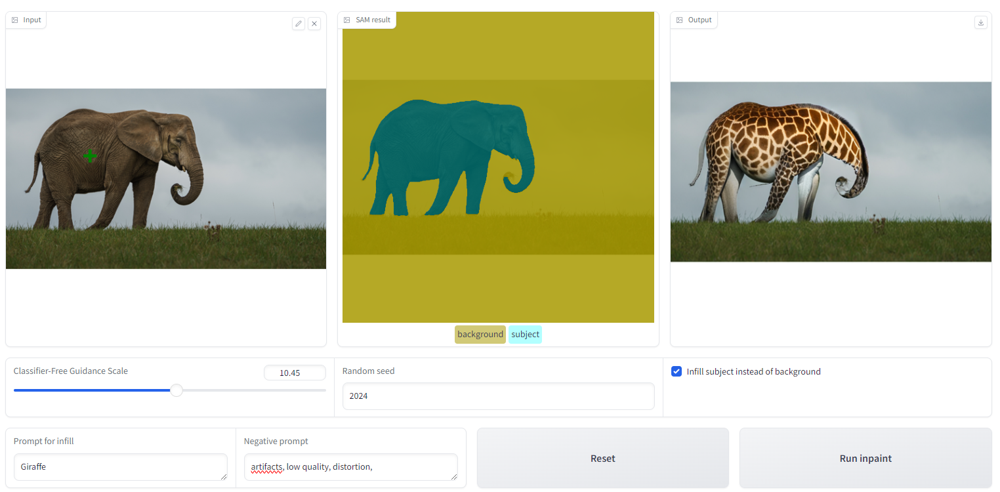

# AI Photo Editing with Inpainting

This project focuses on building an app that allows users to modify images by either changing the background while keeping the subject intact or replacing the subject while preserving the background.

The core of the app's functionality is powered by the **Segment Anything Model (SAM)** and **text-to-image diffusion models**, both sourced from **Hugging Face**. The process begins with the user uploading an image and selecting the main subject by clicking on it. SAM, obtained from Hugging Face, generates a mask around the selected object. The most accurate mask is then presented to the user, who can either accept it or refine it by adding more points. After the mask is finalized, the user provides a text description (with an optional negative prompt) to specify a new background. A Hugging Face diffusion model generates the new background based on this input, and the final image is displayed. Users can also choose to invert the mask to swap out the subject while keeping the original background.

This app leverages SAM from Hugging Face for precise object masking and diffusion models from Hugging Face for generating new backgrounds or subjects, enabling dynamic image transformations such as background swapping, subject replacement, and object removal.

Sample image showing segmenting an object (elephant in this case) and replacing the background using a text prompt

Sample image showing segmenting an object (elephant in this case) and infilling/replacing the object area using a text prompt